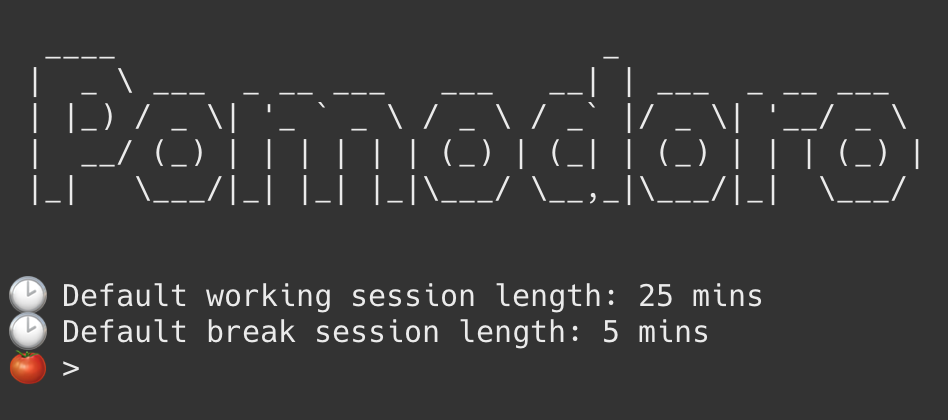

# Simple Pomodoro

A terminal based simple pomodoro application to challenge yourself and focus on your tasks.

## Features

* interactive command line interface
* editable working duration and break duration
* session logging

## How to use?

1. Clone the repository and `cd` into folder
2. Run `python pomodoro.py`

## CLI commands:

Note: The default values:

* Working duration: 25 mins 
* Break duration: 5 mins
* Session name: PomoSession

To start a session just type `start` or edit the default duration by typing something like `start 55`.

#### Command Format

* `start <duration>`
* `break <duration>`
* `session <session_name>`
* `exit`

To exit the program, you can use the command `exit` or `ctrl-c` which has been handled to exit gracefully.

You can also use multiple commands like:

1. `start 50 break 10`
2. `break 15 session AnotherSession`
3. `start 25 break 10 session YetAnotherSession` 

Please note that, currently `"start", "break" and "session"` commands can be used in the same order. After every entered command, the session begins.

The sessions are logged with `session_id, session_name, start_time, and end_time` in `session_log.json` for analysis.

## Contributions

Please feel free to add new features to the application. 

